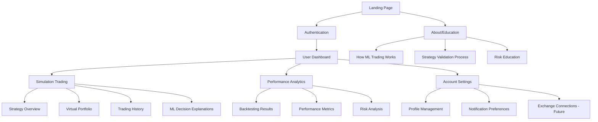
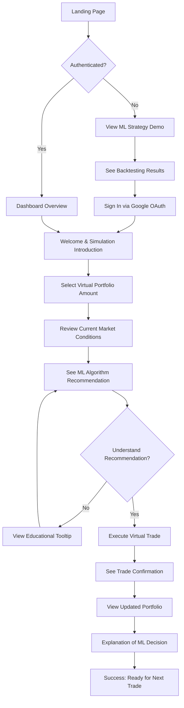

# Tiris Portal UI/UX Specification

This document defines the user experience goals, information architecture, user flows, and visual design specifications for Tiris Portal's user interface. It serves as the foundation for visual design and frontend development, ensuring a cohesive and user-centered experience.

## Change Log
| Date | Version | Description | Author |
|------|---------|-------------|--------|
| 2025-08-31 | 1.0 | Initial UI/UX specification creation | Sally (UX Expert) |

## Overall UX Goals & Principles

### Target User Personas

**Primary Persona: Crypto-Curious Non-Technical Investor**
- **Demographics:** Ages 25-55, middle to upper-middle class with discretionary investment capital, college-educated but not in technical fields
- **Tech Comfort:** Comfortable with apps and websites but intimidated by programming or complex financial interfaces
- **Current Behavior:** Interested in cryptocurrency investment, currently using simple buy-and-hold strategies, researches online but struggles with technical complexity
- **Pain Points:** Wants sophisticated trading strategies without learning programming, needs confidence through education before investing, requires transparency in how investments are managed
- **Goals:** Generate passive income through automated trading, learn about quantitative strategies risk-free, maintain control and visibility over investments

### Usability Goals

1. **Ease of Learning:** New users can understand ML trading concepts and start simulation within 10 minutes of landing
2. **Education-First Confidence:** 90% of users feel "confident" or "very confident" about trading after completing simulation phase
3. **Transparent Understanding:** 80% of users can correctly explain key performance metrics (ROI, Sharpe ratio) after using the platform
4. **Efficient Progression:** Users complete 5+ simulation trades before feeling ready for live trading, with clear progress indicators
5. **Error Prevention:** Clear validation and educational context for all financial decisions and configurations

### Design Principles

1. **Education Before Action** - Never allow users to make financial decisions without understanding the implications and seeing simulated results first
2. **Transparency Through Visualization** - Complex ML algorithms become trustworthy through clear performance data, backtesting results, and decision explanations
3. **Progressive Disclosure** - Start simple (landing page education) and gradually reveal complexity (simulation → live trading) as user confidence grows
4. **Professional Trust** - Every design element reinforces credibility and financial competence to build confidence in non-technical users
5. **Mobile-First Trading** - Cryptocurrency markets never sleep, so critical monitoring and decision-making must work perfectly on mobile devices

## Information Architecture (IA)

### Site Map / Screen Inventory

### Navigation Structure

**Primary Navigation:** 
- Clean top navigation bar with: Dashboard, Simulation, Analytics, Profile
- Persistent "Start Simulation" CTA for unauthenticated users
- Clear authentication state indicator (Sign In/User Menu)

**Secondary Navigation:** 
- Contextual sidebar within major sections (Dashboard tabs, Simulation tools)
- Educational tooltips and "Learn More" links throughout
- Quick access to key performance metrics as persistent widgets

**Breadcrumb Strategy:** 
- Simple path indication: Dashboard > Simulation > Strategy Details
- Educational context preserved: "Learning Mode" indicator during simulation
- Clear "Exit to Dashboard" options from deep educational content

## User Flows

### Flow 1: Education-First Onboarding & First Simulation Trade

**User Goal:** Transform from curious visitor to confident simulation trader who understands ML strategy performance

**Entry Points:** 
- Landing page hero CTA "Start Learning"
- Direct link from marketing/referrals
- Return visitor accessing dashboard

**Success Criteria:** 
- User completes first simulation trade within 10 minutes
- User can explain what the ML algorithm decided and why
- User expresses confidence to continue simulation trading

#### Flow Diagram

#### Edge Cases & Error Handling:
- **Authentication fails:** Clear error message with retry option, fallback to email signup
- **Market closed/low liquidity:** Educational message explaining timing, option to see historical examples
- **User confusion about ML recommendation:** Progressive explanation system with "Tell me more" at each level
- **Technical errors during simulation:** Graceful fallback with apology and alternative learning path
- **User wants to skip education:** Gentle redirect explaining why simulation comes first, with progress indicators

**Notes:** This flow prioritizes education over speed, which aligns with your core principle. The ML recommendation explanation is crucial - users need to trust the algorithm before using real money. The "understanding check" prevents users from blindly clicking through without learning.

## Wireframes & Mockups

**Primary Design Files:** TBD - Recommended design tool: Figma for collaborative design and developer handoff

### Key Screen Layouts

#### Screen 1: Landing Page Hero Section

**Purpose:** Immediately communicate ML trading value proposition and build credibility for non-technical users

**Key Elements:**
- Compelling headline: "ML-Powered Trading Made Simple" with credibility proof
- Live/demo trading performance visualization showing profitable ML decisions
- Clear "Start Learning" CTA that leads to simulation, not immediate signup
- Trust indicators: backtesting results, verification badges, testimonials

**Interaction Notes:** Hero section should scroll to reveal more detailed performance proof. ML demo should be interactive but not overwhelming - simple buy/sell indicators with profit/loss visualization.

**Design File Reference:** [Future Figma frame link]

#### Screen 2: Simulation Trading Interface

**Purpose:** Provide risk-free learning environment where users build confidence in ML strategies

**Key Elements:**
- Virtual portfolio balance with clear "This is Practice Money" indicators
- Current market conditions panel with educational context
- ML recommendation panel with confidence level and "Why?" explanation
- Simple Execute/Learn More action buttons
- Progress tracker showing simulation milestones

**Interaction Notes:** Every ML recommendation includes expandable explanation. Trade execution triggers celebratory micro-interactions for successful learning moments. Portfolio updates should be visually satisfying to encourage continued engagement.

**Design File Reference:** [Future Figma frame link]

#### Screen 3: ML Strategy Performance Dashboard

**Purpose:** Demonstrate algorithm credibility through transparent performance metrics and backtesting results

**Key Elements:**
- Performance charts showing ROI over multiple time periods
- Sharpe ratio and risk metrics with user-friendly explanations
- Backtesting results across different market conditions
- Recent trading decisions with explanations and outcomes

**Interaction Notes:** All financial metrics include educational tooltips. Charts should be interactive with zoom/filter capabilities. Performance data updates in real-time during simulation mode.

**Design File Reference:** [Future Figma frame link]

## Component Library / Design System

**Design System Approach:** Hybrid approach using Tailwind CSS utilities with custom Tiris-branded components, leveraging Headless UI (Radix) for accessibility compliance. This aligns with your technical architecture while ensuring rapid development and consistent user experience.

### Core Components

#### Component 1: TradingCard

**Purpose:** Consistent container for all financial data displays (portfolio values, performance metrics, trade confirmations)

**Variants:** 
- Default: Standard financial data display
- Success: Profitable trades or positive performance
- Warning: Risk alerts or important notices  
- Error: Losses or critical issues

**States:** Default, hover, loading, disabled

**Usage Guidelines:** Always include monetary values with proper formatting ($1,234.56). Use success/error variants sparingly to maintain impact. Include loading states for all real-time data.

#### Component 2: MLExplanationPanel

**Purpose:** Standardized way to explain ML algorithm decisions and build user trust

**Variants:**
- Compact: Tooltip-style quick explanation
- Detailed: Full reasoning breakdown with confidence levels
- Educational: Step-by-step learning mode for new users

**States:** Collapsed, expanded, loading (when fetching explanation)

**Usage Guidelines:** Never show ML recommendations without explanation option. Use progressive disclosure - start compact, allow expansion. Include confidence indicators (High/Medium/Low) with visual cues.

#### Component 3: PerformanceChart

**Purpose:** Reusable financial data visualization maintaining consistent styling and interaction patterns

**Variants:**
- LineChart: Portfolio value over time, performance trends
- BarChart: Comparative performance, monthly returns
- DonutChart: Portfolio allocation, risk distribution

**States:** Loading, interactive, static (for screenshots/reports)

**Usage Guidelines:** Always include time period controls. Use consistent color coding (green=profit, red=loss, blue=neutral). Provide both absolute values and percentage changes. Include accessibility features for screen readers.

#### Component 4: SimulationProgressTracker

**Purpose:** Guide users through education-first journey with clear milestones and encouragement

**Variants:**
- Linear: Step-by-step progress bar
- Circular: Overall completion percentage
- Milestone: Achievement-based progress with rewards

**States:** Not started, in progress, completed, locked (future features)

**Usage Guidelines:** Celebrate small wins to maintain engagement. Show both current progress and next milestone. Use encouraging copy ("Great progress!" vs "Step 2 of 10"). Include estimated time to completion.

## Branding & Style Guide

### Visual Identity

**Brand Guidelines:** Building on Tiris brand identity focused on ML excellence, transparency, and accessibility for non-technical users. Professional financial credibility with approachable, educational tone.

### Color Palette

| Color Type | Hex Code | Usage |
|------------|----------|--------|
| Primary | #3B82F6 | Primary actions, ML confidence indicators, main CTA buttons |
| Secondary | #6366F1 | Secondary actions, educational highlights, progress indicators |
| Accent | #10B981 | Success states, profitable trades, positive performance |
| Success | #22C55E | Confirmations, completed simulations, portfolio gains |
| Warning | #F59E0B | Risk alerts, important notices, attention-required items |
| Error | #EF4444 | Losses, errors, destructive actions, critical warnings |
| Neutral | #6B7280, #9CA3AF, #D1D5DB | Text, borders, backgrounds, inactive states |

### Typography

#### Font Families
- **Primary:** Inter (clean, professional, excellent for financial data)
- **Secondary:** Inter (consistent across all elements)
- **Monospace:** JetBrains Mono (for numerical data, code snippets)

#### Type Scale

| Element | Size | Weight | Line Height |
|---------|------|--------|-------------|
| H1 | 48px | 700 | 1.2 |
| H2 | 36px | 600 | 1.3 |
| H3 | 24px | 600 | 1.4 |
| Body | 16px | 400 | 1.6 |
| Small | 14px | 400 | 1.5 |

### Iconography

**Icon Library:** Lucide React - clean, consistent icon system perfect for financial interfaces

**Usage Guidelines:** 
- 24px standard size for interface icons
- 16px for inline text icons  
- Use outline style for consistency
- Profit/loss icons: TrendingUp (green) / TrendingDown (red)
- ML/AI concepts: Brain, Target, TrendingUp icons

### Spacing & Layout

**Grid System:** 12-column responsive grid with consistent gutters
- Mobile: 16px margins, 12px gutters
- Tablet: 24px margins, 16px gutters  
- Desktop: 32px margins, 24px gutters

**Spacing Scale:** 4px base unit system (4px, 8px, 12px, 16px, 24px, 32px, 48px, 64px)

## Accessibility Requirements

### Compliance Target

**Standard:** WCAG 2.1 AA compliance - essential for financial platforms to ensure legal compliance and inclusive access to trading opportunities

### Key Requirements

**Visual:**
- Color contrast ratios: 4.5:1 minimum for normal text, 3:1 for large text and UI components
- Focus indicators: 2px solid blue outline visible on all interactive elements, never rely on color alone
- Text sizing: Support browser zoom up to 200% without horizontal scrolling, minimum 16px base font size

**Interaction:**
- Keyboard navigation: Full platform functionality accessible via keyboard, logical tab order through trading interfaces
- Screen reader support: All financial data includes descriptive labels, trading actions have clear confirmation messages
- Touch targets: Minimum 44px×44px for all interactive elements, especially critical for mobile trading

**Content:**
- Alternative text: All charts and performance visualizations include detailed alt text describing trends and key data points
- Heading structure: Logical H1-H6 hierarchy, especially important for complex financial data organization
- Form labels: All trading inputs clearly labeled, error messages associated with specific fields

### Testing Strategy

**Comprehensive accessibility testing approach:**
- Automated testing with aXe-core integrated into development workflow
- Manual keyboard navigation testing for all critical trading flows
- Screen reader testing with NVDA/JAWS for financial data comprehension
- Color contrast validation for all profit/loss indicators and status messages
- User testing with actual users who have disabilities, particularly for trading simulation flows

## Responsiveness Strategy

### Breakpoints

| Breakpoint | Min Width | Max Width | Target Devices |
|------------|-----------|-----------|----------------|
| Mobile | 320px | 767px | iPhone SE, Android phones, small tablets in portrait |
| Tablet | 768px | 1023px | iPad, Android tablets, laptops with small screens |
| Desktop | 1024px | 1439px | Standard laptops, desktop monitors |
| Wide | 1440px | - | Large monitors, ultrawide displays, multi-monitor setups |

### Adaptation Patterns

**Layout Changes:** 
- Mobile: Single column layout with collapsible navigation, full-width cards
- Tablet: Two-column layout for dashboard widgets, sidebar navigation becomes drawer
- Desktop: Multi-column dashboard with persistent sidebar, optimal chart sizing
- Wide: Additional contextual panels, larger charts with more detailed data visualization

**Navigation Changes:** 
- Mobile: Hamburger menu with clear "Start Simulation" CTA always visible
- Tablet: Tab-based navigation with icon + text labels
- Desktop: Full horizontal navigation with dropdown menus for sub-sections
- Wide: Additional quick-access shortcuts and breadcrumb navigation

**Content Priority:** 
- Mobile: Portfolio value and current ML recommendation take priority, secondary metrics accessible via tabs
- Tablet: Balance between current status and historical performance in split view
- Desktop: Full dashboard with real-time updates and comprehensive analytics
- Wide: Enhanced with additional educational content panels and detailed market context

**Interaction Changes:** 
- Mobile: Touch-optimized controls, swipe gestures for chart navigation, larger tap targets
- Tablet: Hybrid touch/mouse support, optimized for both portrait and landscape modes
- Desktop: Mouse-hover states, keyboard shortcuts, more dense information layouts
- Wide: Advanced interactions like drag-and-drop for dashboard customization

## Animation & Micro-interactions

### Motion Principles

**Purposeful Motion for Financial Trust:**
- All animations serve functional purposes (feedback, guidance, data visualization) rather than decoration
- Subtle, professional animations that reinforce confidence rather than distract from financial decisions
- Respect user preferences for reduced motion (prefers-reduced-motion CSS media query)
- Fast, responsive interactions that match the pace of financial markets
- Smooth transitions that help users understand state changes and data relationships

### Key Animations

- **Portfolio Value Updates:** Smooth number counting animation when values change (Duration: 800ms, Easing: ease-out) - helps users track gains/losses
- **ML Recommendation Reveal:** Gentle slide-in with confidence indicator animation (Duration: 400ms, Easing: ease-in-out) - builds anticipation for algorithm insights
- **Trade Execution Success:** Subtle green pulse animation with checkmark (Duration: 600ms, Easing: bounce) - provides satisfying confirmation feedback
- **Chart Data Loading:** Progressive line drawing animation for performance charts (Duration: 1200ms, Easing: ease-in-out) - makes data feel more trustworthy and engaging
- **Simulation Progress:** Smooth progress bar fill with celebration micro-animations at milestones (Duration: 300ms, Easing: ease-out) - encourages continued learning
- **Error State Recovery:** Gentle shake animation for form errors, smooth fade-in for correction guidance (Duration: 200ms, Easing: ease-out) - helps without alarming users
- **Navigation Transitions:** Smooth page transitions that maintain context between sections (Duration: 250ms, Easing: ease-in-out) - reduces cognitive load during exploration

## Performance Considerations

### Performance Goals

- **Page Load:** Landing page loads in under 2 seconds on 3G connections, dashboard in under 3 seconds
- **Interaction Response:** All user interactions (button clicks, form submissions) respond within 100ms
- **Animation FPS:** Maintain 60fps for all animations and chart interactions, degrade gracefully on lower-end devices

### Design Strategies

**Optimization strategies that impact UX design decisions:**
- **Progressive Image Loading:** Hero section uses optimized WebP images with blur-to-clear loading for professional appearance without delays
- **Chart Data Virtualization:** Large performance datasets render only visible portions, with smooth scrolling for historical data exploration
- **Component Lazy Loading:** Dashboard widgets load on-demand as users scroll or navigate, maintaining fast initial page load
- **Skeleton Loading States:** All financial data displays show skeleton placeholders during loading, preventing layout shifts and maintaining perceived performance
- **Intelligent Caching:** ML recommendations and backtesting results cache intelligently to reduce API calls while ensuring data freshness
- **Critical Path Prioritization:** Essential trading information (current portfolio value, ML recommendations) loads first, with secondary analytics loading progressively

## Next Steps

### Immediate Actions

1. **Stakeholder Review:** Present UX specification to product team and gather feedback on user personas and design principles
2. **Create Visual Designs:** Begin detailed mockups in Figma for the three core screens (Landing, Simulation, Performance Dashboard)
3. **Technical Architecture Handoff:** Collaborate with Design Architect to ensure component library aligns with React + Tailwind implementation
4. **User Research Validation:** Conduct user interviews with target demographic to validate education-first approach and information architecture
5. **Accessibility Audit Planning:** Set up processes for ongoing accessibility testing integration with development workflow

### Design Handoff Checklist

- ✅ All user flows documented
- ✅ Component inventory complete  
- ✅ Accessibility requirements defined
- ✅ Responsive strategy clear
- ✅ Brand guidelines incorporated
- ✅ Performance goals established